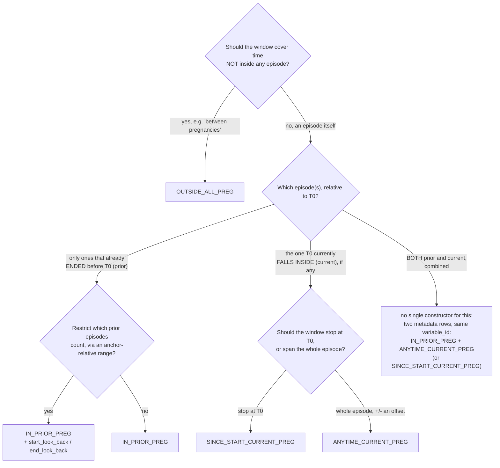

# Using Episode-Based (Pregnancy) Windows

This guide shows how to anchor study variables to a *recurring* event (pregnancy here, or any repeatable start/end episode) instead of a single fixed anchor date. It documents the metadata shape implemented in `R/pregnancy_window.R`. The earlier free-text design is retained only as a clearly labeled [historical sketch](examples/pregnancy_examples.md).

## The idea

Every constructor in this family answers the same two questions about a person's episodes (their pregnancies):

1. **Which episode(s) matter relative to the anchor date ([T0](<definitions/Anchor Column (T0).md>))?**
   - `PRIOR`: every episode that ended before `T0`
   - `CURRENT`: the one episode `T0` falls inside, if any
   - `OUTSIDE_ALL`: the gaps between all episodes, not any specific one
2. **Where do the window boundaries sit, relative to the selected episode(s)?**
   - An offset (`start_offset`/`end_offset`), optionally capped against a second boundary (`end_cap_offset`).

There is one shared internal engine underneath (`event_window_engine()`); the four public constructor names below are that engine pre-configured with a selection rule. Users interact with it through `define_window()` or `anchor()`, rather than calling the internal engine directly.

| `constructor`                | Selects                         | Window                                                       |
| ---------------------------- | ------------------------------- | ------------------------------------------------------------ |
| [IN_PRIOR_PREG](definitions/IN_PRIOR_PREG.md) | every episode ending before `T0` | `episode_start + start_offset` to `episode_end + end_offset` |
| [SINCE_START_CURRENT_PREG](definitions/SINCE_START_CURRENT_PREG.md) | the episode containing `T0` | `episode_start + start_offset` to `T0 + end_offset` |
| [ANYTIME_CURRENT_PREG](definitions/ANYTIME_CURRENT_PREG.md) | the episode containing `T0` | `episode_start + start_offset` to `episode_end + end_offset` |
| [OUTSIDE_ALL_PREG](definitions/OUTSIDE_ALL_PREG.md) | gaps between *all* episodes | each gap within `[T0 + start_offset, T0 + end_offset]` |

`IN_PRIOR_PREG` can produce more than one candidate window per person (one per prior episode); `OUTSIDE_ALL_PREG` can too (one per gap). `anchoR` handles that automatically, see "Multiple candidate windows" below.

### `start_offset`/`end_offset` vs `start_look_back`/`end_look_back` these are not the same thing

Both pairs shift dates around, which invites mixing them up. The short version: `start_offset`/`end_offset` are **not consistently "the pregnancy's own offset"**, whether they're relative to the *event* (the episode) or to the *anchor* (`T0`) depends on which constructor you're using. `start_look_back`/`end_look_back` are a single, separate mechanism (an eligibility filter, `IN_PRIOR_PREG`-only) that a reader could easily mistake for "the anchor-relative version of the other two", because for one constructor it is exactly that.

| constructor                | `start_offset` / `end_offset` are relative to&hellip;                                                                                             | `start_look_back` / `end_look_back`                                                                                                       |
| -------------------------- | ------------------------------------------------------------------------------------------------------------------------------------------------- | ----------------------------------------------------------------------------------------------------------------------------------------- |
| `IN_PRIOR_PREG`            | the **event**: shift the selected episode's own `event_start`/`event_end`                                                                         | optional eligibility filter: an episode outside `[T0 + start_look_back, T0 + end_look_back]` is dropped *before* a window is built at all |
| `ANYTIME_CURRENT_PREG`     | the **event**: shift the selected episode's own `event_start`/`event_end`                                                                         | not read; setting them has no effect                                                                                                      |
| `SINCE_START_CURRENT_PREG` | mixed: `start_offset` shifts the episode's `event_start`, but `end_offset` shifts the **anchor** (`T0 + end_offset`)                              | not read; setting them has no effect                                                                                                      |
| `OUTSIDE_ALL_PREG`         | the **anchor**: there is no single selected episode to shift; together they define the search range `[T0 + start_offset, T0 + end_offset]` itself | not read; setting them has no effect                                                                                                      |

A few things that follow from the table, since they're easy to get wrong:

- `start_look_back`/`end_look_back` don't *define* a window the way the table's other column does, they only gate which episodes are candidates. The window itself is still built from `start_offset`/`end_offset` on whichever episode survives, unaffected by where the lookback range's own edges fall. See [IN_PRIOR_PREG](definitions/IN_PRIOR_PREG.md) and the worked example in [Pregnancy_window_worked_example.md](examples/Pregnancy_window_worked_example.md) for a computed, verified case.
- `OUTSIDE_ALL_PREG` is the constructor most likely to get confused with the lookback columns, because its `start_offset`/`end_offset` play the anchor-relative-range role that `start_look_back`/`end_look_back` play for `IN_PRIOR_PREG`. Setting `start_look_back`/`end_look_back` on an `OUTSIDE_ALL_PREG` row is a **silent no-op**: to control its search range, use `start_offset`/`end_offset` there instead.

## Which constructor should I use?



A few notes to go with the diagram:

- The four boxes on the right are exactly the four constructors from the table above; [IN_PRIOR_PREG](definitions/IN_PRIOR_PREG.md), [SINCE_START_CURRENT_PREG](definitions/SINCE_START_CURRENT_PREG.md), [ANYTIME_CURRENT_PREG](definitions/ANYTIME_CURRENT_PREG.md), and [OUTSIDE_ALL_PREG](definitions/OUTSIDE_ALL_PREG.md) each have their own page with more detail.
- "Restrict which prior episodes count" (`Q3`) is about eligibility, not window shape, see the `start_look_back`/`end_look_back` callout just above: it decides whether a prior episode is considered at all, not where its window sits once it survives.
- "Stop at T0 vs span the whole episode" (`Q4`) is the difference between asking "what's happened *so far* in this pregnancy" (`SINCE_START_CURRENT_PREG`) and "what's true *anywhere* in this pregnancy, maybe with a buffer after it ends" (`ANYTIME_CURRENT_PREG`).
- There is no dedicated "prior-or-current" constructor. Because `apply_window_constructors()` groups metadata rows by `constructor` and combines every row's output before the selector runs, two metadata rows sharing the same `variable_id` (one `IN_PRIOR_PREG`, one `ANYTIME_CURRENT_PREG`) produce candidate windows that get selected over together, same as the "Multiple candidate windows" behavior below, so this combination doesn't need new R code.

## Step 1: attach episodes to the population

Unlike `T0`, episodes are a *list* per person (a person can have any number of pregnancies), so they don't fit as a plain population column. Nest them instead: one row per person still, with a list-column holding that person's own small table of episodes.

The nested table's columns must be named `event_start`/`event_end` (whatever your source data calls them, rename them to this on the way in).

```r
library(anchoR)
library(data.table)

# Your own long-format episode source, one row per pregnancy.
pregnancy_periods <- data.table(
  person_id     = c("1", "1", "2"),
  episode_start = as.Date(c("2020-01-01", "2021-02-15", "2021-02-15")),
  episode_end   = as.Date(c("2020-09-01", "2021-05-20", "2021-08-01"))
)

# Your usual one-row-per-person population.
population <- data.table(
  person_id = c("1", "2"),
  T0        = as.Date(c("2022-08-16", "2022-08-16"))
)

# Nest: each population row gets that person's own episode table.
population[, pregnancy_episodes := lapply(person_id, function(id) {
  pregnancy_periods[
    person_id == id,
    .(event_start = episode_start, event_end = episode_end)
  ]
})]
```

`population$pregnancy_episodes` is now a list-column; `population` still has exactly one row per person (or per `person_id x T0`, same as any other `anchoR` population).

## Step 2: write metadata

Alongside the usual columns (`variable_id`, `concept_id`, `selector`, `start_offset`, `end_offset`), add:

- `constructor`: one of the four names above
- `event_col`: the name of the population list-column from step 1 (`"pregnancy_episodes"` in this example)
- `end_cap_offset` (optional): when set, the final window end is `pmin(window_end, episode_start + end_cap_offset)`
- `start_look_back`/`end_look_back` (optional, `IN_PRIOR_PREG` only): when both are set, an episode not overlapping `[T0 + start_look_back, T0 + end_look_back]` is dropped before its window is even built, see the callout above

```r
metadata <- data.table(
  variable_id  = "gest_diabetes_prior",
  concept_id   = "GEST_DIAB",
  constructor  = "IN_PRIOR_PREG",
  selector     = "LATEST",
  start_offset = 0L,
  end_offset   = 0L,
  event_col    = "pregnancy_episodes"
)
```

## Step 3: anchor and read the result

Nothing else changes: `anchor()`/`anchor_by_variable()` and `get_anchor_result()` work exactly as they do for `GENERIC` metadata.

```r
concepts <- data.table(
  person_id  = c("1", "1"),
  concept_id = c("GEST_DIAB", "GEST_DIAB"),
  date       = as.Date(c("2020-05-01", "2021-03-01")),
  value      = c("TRUE", "TRUE")
)

hive_path <- tempfile(pattern = "anchor-hive-")
dir.create(hive_path)

anchor(
  population       = population,
  metadata         = metadata,
  concepts         = concepts,
  anchor_hive_path = hive_path
)

get_anchor_result(
  metadata         = metadata,
  anchor_hive_path = hive_path,
  result_shape     = "long"
)
#>    person_id         T0         variable_id window_name       date  value
#> 1:         1 2022-08-16 gest_diabetes_prior        <NA> 2021-03-01   TRUE
```

Person 1 has two prior pregnancies (ending 2020-09-01 and 2021-05-20, both before `T0 = 2022-08-16`); both `GEST_DIAB` records (2020-05-01 and 2021-03-01) fall inside one of them, and `LATEST` picks the later one. Person 2 has no prior pregnancy relative to their `T0`, so they produce no row at all, same sparse-output behavior as any other unmatched variable.

## Multiple candidate windows for one variable

`IN_PRIOR_PREG` and `OUTSIDE_ALL_PREG` can generate several candidate windows per person for the same variable (one per prior episode, or one per gap). The selector aggregates matches across all candidate window rows for that output key, exactly as shown above (`LATEST` picked the latest `GEST_DIAB` record across both of person 1's prior-pregnancy windows). Candidate windows are not deduplicated before the concepts join: overlapping episodes can make one concept event match more than once, so keep episodes/windows non-overlapping when using `COUNT` or `ALL` and distinct-event semantics matter.

## Constructor-by-constructor reference

Using the person below (three pregnancies) anchored at `T0 = 2022-08-16` (which falls inside the third episode):

| episode | start        | end          |
| ------- | ------------ | ------------ |
| 1       | `2020-01-01` | `2020-09-01` |
| 2       | `2021-02-15` | `2021-05-20` |
| 3       | `2022-03-01` | `2022-12-01` |

| constructor                                                                                      | resulting window(s)                                                                           |
| ------------------------------------------------------------------------------------------------ | --------------------------------------------------------------------------------------------- |
| `IN_PRIOR_PREG` (`start_offset=0, end_offset=0`)                                                 | `[2020-01-01, 2020-09-01]` and `[2021-02-15, 2021-05-20]`                                     |
| `SINCE_START_CURRENT_PREG` (`start_offset=0, end_offset=0`)                                      | `[2022-03-01, 2022-08-16]` (episode 3's start to `T0`)                                        |
| `ANYTIME_CURRENT_PREG` (`start_offset=0, end_offset=30`)                                         | `[2022-03-01, 2022-12-31]` (episode 3, +30 days)                                              |
| `OUTSIDE_ALL_PREG` (`start_offset=0, end_offset=-1000`)                                          | `[2019-11-20, 2019-12-31]`, `[2020-09-02, 2021-02-14]`, `[2021-05-21, 2022-02-28]`            |
| `IN_PRIOR_PREG` capped (`start_offset=90, end_cap_offset=166`)                                   | `[2020-03-31, 2020-06-15]` and `[2021-05-16, 2021-05-20]`                                     |
| `IN_PRIOR_PREG` with lookback (`start_look_back=-592, end_look_back=0`, i.e. `[2021-01-01, T0]`) | `[2021-02-15, 2021-05-20]` only, episode 1 dropped entirely (ended before the lookback range) |

Notes on `OUTSIDE_ALL_PREG`: it searches `[T0 + start_offset, T0 + end_offset]` for the parts *not* covered by any episode. An episode always fences a gap, even the one containing `T0` itself, so there is no gap after episode 3 starts, even though `T0` is inside the search range.

Notes on the `IN_PRIOR_PREG` lookback row: `start_look_back`/`end_look_back` are separate columns from `start_offset`/`end_offset` (both `NA` unless set), and only `IN_PRIOR_PREG` reads them. They decide which episodes are candidates at all (episode 1 never becomes one here, its window doesn't even get computed), not where a surviving episode's window sits, that's still `start_offset`/`end_offset`'s job, unaffected by the lookback range. This is a different mechanism from `OUTSIDE_ALL_PREG`'s search range above, even though both are "an anchor-relative range" conceptually, see the callout near the top of this page for why they use different column names.

Notes on the capped `IN_PRIOR_PREG` row: this is the same constructor as the first row, just with different metadata values, `start_offset = 90` shifts the window start 90 days into the episode, and `end_cap_offset = 166` caps the window end at `episode_start + 166` days if that's earlier than `episode_end + end_offset`. This is exactly how `pregnancy_examples.md`'s `preg_example_1` and `preg_example_5` differ, same constructor, different offsets, and it's the direct answer to "can one function cover all of these": yes, by moving what varies per study variable into metadata instead of into new R code.

## Full worked example (all constructors from pregnancy_examples.md)

```r
pregnancy_periods <- data.table(
  person_id     = c("1", "1", "1", "2", "2", "3"),
  episode_start = as.Date(c(
    "2020-01-01", "2021-02-15", "2022-03-01",
    "2021-02-15", "2022-03-01",
    "2021-02-15"
  )),
  episode_end = as.Date(c(
    "2020-09-01", "2021-05-20", "2022-12-01",
    "2021-08-01", "2022-12-01",
    "2021-09-14"
  ))
)

population <- data.table(
  person_id = c("1", "1", "2", "3"),
  T0        = as.Date(c("2021-04-02", "2022-08-16", "2022-08-16", "2021-04-02"))
)
population[, pregnancy_episodes := lapply(person_id, function(id) {
  pregnancy_periods[
    person_id == id,
    .(event_start = episode_start, event_end = episode_end)
  ]
})]

metadata <- data.table(
  variable_id = c(
    "gest_diabetes_prior", "gest_diabetes_current",
    "multi_foetal_current", "obesity_outside_preg", "abortion_prior_capped"
  ),
  concept_id = c(
    "GEST_DIAB", "GEST_DIAB", "MULTI_FOETAL", "OBESITY", "ABORTION"
  ),
  constructor = c(
    "IN_PRIOR_PREG", "SINCE_START_CURRENT_PREG", "ANYTIME_CURRENT_PREG",
    "OUTSIDE_ALL_PREG", "IN_PRIOR_PREG"
  ),
  selector       = c("LATEST", "LATEST", "EARLIEST", "LATEST", "LATEST"),
  start_offset   = c(0L, 0L, 0L, 0L, 90L),
  end_offset     = c(0L, 0L, 30L, -3652L, 0L),
  end_cap_offset = c(NA_real_, NA_real_, NA_real_, NA_real_, 166),
  event_col      = "pregnancy_episodes"
)

concepts <- data.table(
  person_id  = c("1", "1", "1", "1", "2"),
  concept_id = c("GEST_DIAB", "MULTI_FOETAL", "OBESITY", "ABORTION", "ABORTION"),
  date  = as.Date(c("2021-05-01", "2022-12-30", "2020-06-15", "2021-07-01", "2021-07-01")),
  value = c(TRUE, TRUE, TRUE, TRUE, TRUE)
)

hive_path <- tempfile(pattern = "anchor-hive-")
dir.create(hive_path)
anchor(population, metadata, concepts, anchor_hive_path = hive_path)
get_anchor_result(metadata, hive_path, result_shape = "long")
#>    person_id         T0            variable_id window_name       date value
#> 1:         2 2022-08-16 abortion_prior_capped         <NA> 2021-07-01  true
#> 2:         1 2022-08-16   gest_diabetes_prior         <NA> 2021-05-01  true
#> 3:         1 2022-08-16  multi_foetal_current         <NA> 2022-12-30  true
```

Only 3 of the 5 variables produce a result here, and that's expected, not a bug: `gest_diabetes_current`'s window for person 1 at `T0 = 2021-04-02` is `[2021-02-15, 2021-04-02]`, which ends before the `GEST_DIAB` record (2021-05-01); and `obesity_outside_preg`'s record (2020-06-15) falls *inside* a pregnancy, so `OUTSIDE_ALL_PREG` correctly excludes it.

## Extending beyond pregnancy

The internal `event_window_engine()` only knows about `event_start`/`event_end` and an anchor date, so the mechanics are not pregnancy-specific. The currently exposed constructor names are pregnancy-oriented, however. A recurring obesity or cancer diagnosis can reuse them unchanged: build an episode table for that condition (deciding upstream how diagnoses collapse into episodes), nest it onto the population under a new `event_col` name, and point metadata at it. If the pregnancy-oriented names would be misleading in your project, wrap the same behavior in a clearly named custom constructor made with `make_constructor()`.

## Things worth validating on real data before relying on this

- `OUTSIDE_ALL_PREG`'s search range (`[T0 + start_offset, T0 + end_offset]`) and "an episode always fences a gap" rule are the implemented interpretation of `pregnancy_examples.md`'s "outside pregnancy" description, worth double-checking against a few real cases, especially ones where `T0` falls inside an ongoing episode.
- A custom constructor built with `make_constructor()` (see the main package docs) still works alongside these, pass it via `define_window()`'s `constructor_env` argument if it isn't defined in the global environment.
