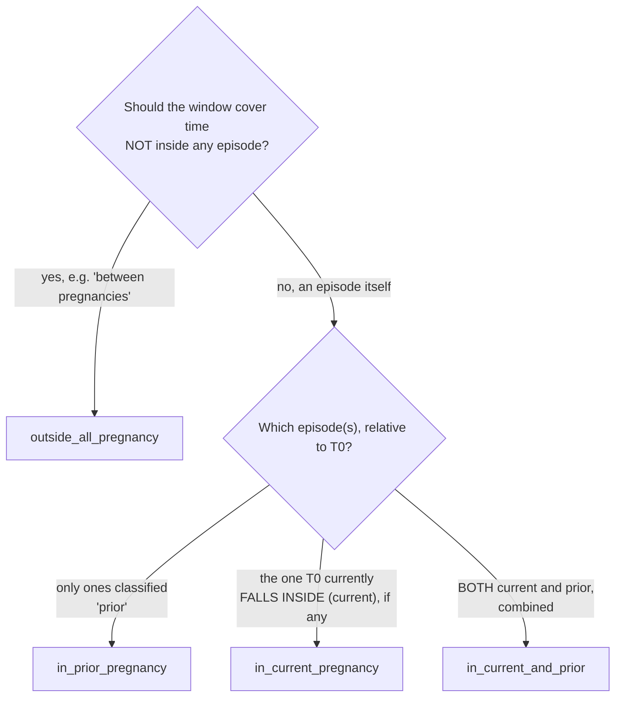

# Using Episode-Based (Pregnancy) Windows

This guide shows how to anchor study variables to a *recurring* event (pregnancy here, or any repeatable start/end episode) instead of a single fixed anchor date. It documents the metadata shape implemented in `R/pregnancy_window.R`. The earlier free-text design is retained only as a clearly labeled [historical sketch](examples/pregnancy_examples.md).

## The idea

Every constructor in this family answers three questions about a person's episodes (their pregnancies):

1. **Which episode(s) matter relative to the anchor date ([T0](<definitions/Anchor Column (T0).md>))?**
   - `in_current_pregnancy`: the one episode `T0` falls inside, if any
   - `in_prior_pregnancy`: every episode classified "prior" (see below)
   - `in_current_and_prior`: both of the above, combined
   - `outside_all_pregnancy`: the gaps between all episodes, not any specific one
2. **Where do a selected episode's window boundaries sit, relative to that episode?**
   - Two independent border-offset pairs, one around `start_episode` and one around `end_episode`. See "Building a window from a selected episode" below.
3. **Does the window need to stay inside a hard, anchor-relative boundary?**
   - `anchor_start_offset`/`anchor_end_offset` optionally clip every resulting window to `[T0 + anchor_start_offset, T0 + anchor_end_offset]`, for all four constructors. See "The hard anchor-relative boundary" below.

There is one shared internal engine underneath (`pregnancy_window_engine()`); the four public constructor names below are that engine pre-configured with a selection rule. Users interact with it through `define_window()` or `anchor()`, rather than calling the internal engine directly. **The formula in this page is a summary [Episode-Based Window Engine](<definitions/Episode-Based Window Engine.md>) is the canonical, complete description; if the two ever disagree, that page is right.**

| `constructor`                                               | Selects                                  |
| ----------------------------------------------------------- | ---------------------------------------- |
| [in_current_pregnancy](definitions/IN_CURRENT_PREG.md)      | the episode containing `T0`, if any      |
| [in_prior_pregnancy](definitions/IN_PRIOR_PREG.md)          | every episode classified "prior"         |
| [in_current_and_prior](definitions/IN_CURRENT_AND_PRIOR.md) | the current episode plus every prior one |
| [outside_all_pregnancy](definitions/OUTSIDE_ALL_PREG.md)    | gaps between *all* episodes              |

`in_prior_pregnancy`, `in_current_and_prior`, and `outside_all_pregnancy` can each produce more than one candidate window per person (one per selected episode, or one per gap). `anchoR` handles that automatically see "Multiple candidate windows" below.

## Which episode is "current", "prior", or "future"?

`classify_episodes()` labels each of a person's episodes relative to the anchor:

- **Current**: the episode containing the anchor (`start_episode <= anchor <= end_episode`). A person's episodes are assumed not to overlap, so there's at most one.
- If a current episode exists, **prior**/**future** are relative to *that episode's own bounds* (ended before its start / starts after its end).
- **If there's no current episode**, prior/future fall back to being relative to the anchor itself instead (ended before the anchor / starts after the anchor).

`in_prior_pregnancy` doesn't require a current episode to exist a person with three episodes, none of which contain `T0`, can still have prior episodes via the anchor-relative fallback.

## Building a window from a selected episode: the border-offset formula

Once an episode is selected, four offset columns in two independent pairs decide where its window (or windows) sit:

- **Start pair**: `before_start_episode_offset` / `after_start_episode_offset`, relative to that episode's own `start_episode`.
- **End pair**: `before_end_episode_offset` / `after_end_episode_offset`, relative to that episode's own `end_episode`.

Each side is `edge + offset` (`0` = exactly on the edge, `NA` = not set):

- **Neither pair fully specified** (each pair has zero or one side set): one shared window, using whichever offset each pair has (or the unshifted edge, if a pair has neither side set).
- **Exactly one pair fully specified** (both sides set): only that pair's region is emitted `[edge + before_offset, edge + after_offset]` and the *other* pair contributes nothing, whether it's unset or only partially set.
- **Both pairs fully specified**: two independent regions, one per pair.

A fully-specified pair must not be inverted (`before_*_offset` later than `after_*_offset`); that's an error. See [Episode-Based Window Engine](<definitions/Episode-Based Window Engine.md>) for the complete rule and more worked examples.

`outside_all_pregnancy` doesn't use these four columns at all see its own row below.

## The hard anchor-relative boundary: `anchor_start_offset`/`anchor_end_offset`

Independently of the border-offset formula above, `anchor_start_offset`/`anchor_end_offset` (both default `NA_real_`) define a hard boundary `[anchor_start_col + anchor_start_offset, anchor_end_col + anchor_end_offset]`, `T0` by default that **every** window from **every** episode-based constructor is clipped to, not just `outside_all_pregnancy`'s. Each side applies independently and only when set:

- a set `anchor_start_offset` raises a window's start up to at least the boundary's lower edge;
- a set `anchor_end_offset` lowers a window's end down to at most the boundary's upper edge;
- leaving one (or both) `NA` leaves that side of the boundary unenforced.

A window that ends up entirely outside the boundary comes out invalid (start after end), exactly like any other window with no valid span it doesn't error, it just produces no result for that candidate window. For `outside_all_pregnancy`, this clip is always a no-op, because its search range already *is* that same boundary.

This is the mechanism to reach for when you have a hard project-wide constraint like "no episode-based window may extend outside `[T0 - 1, T0 + 1]`," independent of whatever the border-offset formula would otherwise produce.

## Which constructor should I use?


```mermaid
flowchart TD
    Q1{"Should the window cover time\nNOT inside any episode?"}
    Q1 -->|yes, e.g. 'between pregnancies'| OUTSIDE["outside_all_pregnancy"]
    Q1 -->|no, an episode itself| Q2{"Which episode(s), relative to T0?"}

    Q2 -->|"only ones classified\n'prior'"| PRIOR["in_prior_pregnancy"]
    Q2 -->|"the one T0 currently\nFALLS INSIDE (current), if any"| CURRENT["in_current_pregnancy"]
    Q2 -->|"BOTH current and prior,\ncombined"| COMBO["in_current_and_prior"]
```

A few notes to go with the diagram:

- The four boxes are exactly the four constructors from the table above; each has its own definitions page with more detail.
- There is no separate "since the start of the current episode, up to today" shape built in `in_current_pregnancy`'s window is always relative to the episode's own `start_episode`/`end_episode`, never the anchor directly. If you need "up to T0," add a second, `GENERIC` variable anchored at `T0` instead, or set `anchor_end_offset = 0` to clip the episode-relative window down to no later than `T0`.

## Step 1: build the episodes table

Unlike `T0`, episodes are a *list* per person (a person can have any number of pregnancies), so they're a separate long table, not a population column one row per episode, required columns `person_id`, `start_episode`, `end_episode`.

```r
library(anchoR)
library(data.table)

# One row per pregnancy, across however many people.
episodes <- data.table(
  person_id     = c("1", "1", "1"),
  start_episode = as.Date(c("2023-01-01", "2024-03-01", "2025-11-01")),
  end_episode   = as.Date(c("2023-09-01", "2024-11-15", "2026-08-01"))
)

# Your usual one-row-per-person population.
population <- data.table(
  person_id = "1",
  T0        = as.Date("2026-02-15")   # falls inside the third episode
)
```

`episodes` is passed as its own argument, alongside `population` and `metadata`; anchoR nests it onto `population` internally (via `nest_episodes_onto_population()`) before any constructor runs. You never build or manage that nested structure yourself.

## Step 2: write metadata

Alongside the usual columns (`variable_id`, `concept_id`, `selector`, `start_offset`, `end_offset` the last two required by `normalize_metadata()` but unused by episode-based constructors), add:

- `constructor`: one of the four names above
- `before_start_episode_offset` / `after_start_episode_offset`, `before_end_episode_offset` / `after_end_episode_offset` (all default `NA_real_`): the border-offset pairs described above
- `anchor_start_offset` / `anchor_end_offset` (default `NA_real_`): the hard anchor-relative boundary described above, applied to all four constructors (and also `outside_all_pregnancy`'s own search range)

```r
metadata <- data.table(
  variable_id  = "gest_diabetes_prior",
  concept_id   = "GEST_DIAB",
  constructor  = "in_prior_pregnancy",
  selector     = "LATEST",
  start_offset = 0L,
  end_offset   = 0L
)
```

With no border offsets and no anchor offsets set at all (as above), each prior episode's own unshifted span becomes its window, unclipped.

## Step 3: anchor and read the result

Nothing else changes: `anchor()`/`anchor_by_variable()` and `get_anchor_result()` work exactly as they do for `GENERIC` metadata, just with `episodes` passed alongside `population`/`metadata`/`concepts`.

```r
concepts <- data.table(
  person_id  = c("1", "1"),
  concept_id = c("GEST_DIAB", "GEST_DIAB"),
  date       = as.Date(c("2023-05-01", "2024-06-01")),
  value      = c("TRUE", "TRUE")
)

hive_path <- tempfile(pattern = "anchor-hive-")
dir.create(hive_path)

anchor(
  population       = population,
  metadata         = metadata,
  concepts         = concepts,
  episodes         = episodes,
  anchor_hive_path = hive_path
)

get_anchor_result(
  metadata         = metadata,
  anchor_hive_path = hive_path,
  result_shape     = "long"
)
#>    person_id         T0         variable_id window_name       date  value
#> 1:         1 2026-02-15 gest_diabetes_prior        <NA> 2024-06-01   TRUE
```

Person 1 has two prior episodes (`[2023-01-01, 2023-09-01]` and `[2024-03-01, 2024-11-15]`); both `GEST_DIAB` records fall inside one of them, and `LATEST` picks the later one.

## Multiple candidate windows for one variable

`in_prior_pregnancy`, `in_current_and_prior`, and `outside_all_pregnancy` can generate several candidate windows per person for the same variable (one per selected episode, or one per gap and a single episode itself can contribute two regions if both border-offset pairs are fully specified). The selector aggregates matches across all candidate window rows for that output key, exactly as shown above. Candidate windows are not deduplicated before the concepts join: overlapping episodes can make one concept event match more than once, so keep episodes/windows non-overlapping when using `COUNT` or `ALL` and distinct-event semantics matter.

## Constructor-by-constructor reference

Using the person below (three episodes) anchored at `T0 = 2026-02-15` (which falls inside the third episode):

| episode | start_episode | end_episode  |
| ------- | ------------- | ------------ |
| 1       | `2023-01-01`  | `2023-09-01` |
| 2       | `2024-03-01`  | `2024-11-15` |
| 3       | `2025-11-01`  | `2026-08-01` |

Every row below was run through `define_window()` directly and verified against its actual output:

| constructor / offsets                                                                          | resulting window(s)                                                                                                                               |
| ---------------------------------------------------------------------------------------------- | ------------------------------------------------------------------------------------------------------------------------------------------------- |
| `in_current_pregnancy` (no border or anchor offsets set)                                       | `[2025-11-01, 2026-08-01]` (episode 3's own unshifted span)                                                                                       |
| `in_current_pregnancy` (`after_end_episode_offset = 14`)                                       | `[2025-11-01, 2026-08-15]` (episode 3, end extended 14 days)                                                                                      |
| `in_current_pregnancy` (no border offsets, `anchor_start_offset = -30, anchor_end_offset = 0`) | `[2026-01-16, 2026-02-15]` (episode 3's unshifted span, clipped to the last 30 days before `T0`)                                                  |
| `in_prior_pregnancy` (no border or anchor offsets set)                                         | `[2023-01-01, 2023-09-01]` and `[2024-03-01, 2024-11-15]`                                                                                         |
| `in_prior_pregnancy` (`before_start_episode_offset = 0, after_start_episode_offset = 90`)      | `[2023-01-01, 2023-04-01]` and `[2024-03-01, 2024-05-30]` (first 90 days of each prior episode; the end pair is unset, so it contributes nothing) |
| `in_current_and_prior` (no border or anchor offsets set)                                       | episode 3's span, plus both prior episodes' spans (3 windows total)                                                                               |
| `outside_all_pregnancy` (`anchor_start_offset = -1172, anchor_end_offset = 0`)                 | `[2022-12-01, 2022-12-31]`, `[2023-09-02, 2024-02-29]`, `[2024-11-16, 2025-10-31]`                                                                |

Notes on `outside_all_pregnancy`: it searches `[T0 + anchor_start_offset, T0 + anchor_end_offset]` for the parts *not* covered by any episode. An episode always fences a gap, even the one containing `T0` itself, so there is no gap after episode 3 starts, even though `T0` is inside the search range.

Notes on the `in_prior_pregnancy` "first 90 days" row: setting only the start pair (`before_start_episode_offset`/`after_start_episode_offset`) turns it into its own self-contained region and drops the end pair's contribution entirely this is the general "exactly one pair fully specified" rule from [Episode-Based Window Engine](<definitions/Episode-Based Window Engine.md>), not something specific to `in_prior_pregnancy`.

Notes on the `in_current_pregnancy` clipped row: `anchor_start_offset`/`anchor_end_offset` don't shape a window the way the border-offset pairs do they narrow whatever window the border-offset formula already produced. Set them wide enough (or leave them `NA`) if you don't want them to interfere with a border-offset window that's meant to reach further than `T0`.

## Extending beyond pregnancy

The internal `pregnancy_window_engine()` only knows about `start_episode`/`end_episode` and an anchor date, so the mechanics are not pregnancy-specific. The currently exposed constructor names are pregnancy-oriented, however. A recurring obesity or cancer diagnosis can reuse them unchanged: build an `episodes` table for that condition (deciding upstream how diagnoses collapse into episodes) and pass it the same way. If the pregnancy-oriented names would be misleading in your project, wrap the same behavior in a clearly named custom constructor made with `make_constructor()`.

## Things worth validating on real data before relying on this

- `outside_all_pregnancy`'s search range and "an episode always fences a gap" rule are the implemented interpretation of `pregnancy_examples.md`'s "outside pregnancy" description, worth double-checking against a few real cases, especially ones where `T0` falls inside an ongoing episode.
- If you set `anchor_start_offset`/`anchor_end_offset` on a variable that also uses border offsets, double-check the two aren't fighting each other a border-offset window that's meant to reach past the anchor boundary will silently come back narrower (or invalid) instead of erroring.
- A custom constructor built with `make_constructor()` (see the main package docs) still works alongside these; pass it via `define_window()`'s `constructor_env` argument if it isn't defined in the global environment.
