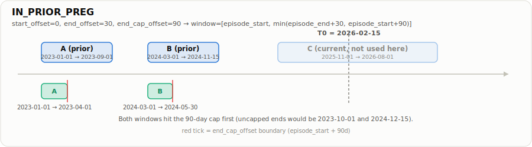
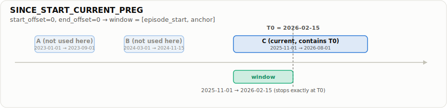
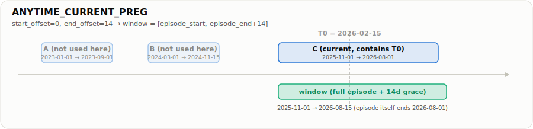
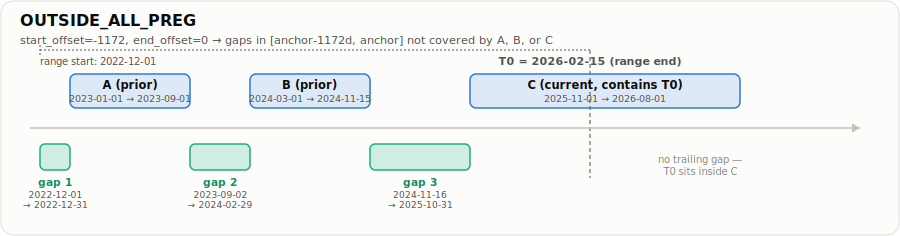

A single numerical example run through all four [[Episode-Based Window Engine|episode-based]] constructors, computed by calling `event_window_engine()` / `outside_all_event_gaps()` directly rather than hand-derived, so the arithmetic is trustworthy.

## Setup

One person with three episodes and an anchor (`T0`) inside the third:

| Episode     | event_start | event_end  |
| ----------- | ----------- | ---------- |
| A (prior)   | 2023-01-01  | 2023-09-01 |
| B (prior)   | 2024-03-01  | 2024-11-15 |
| C (current) | 2025-11-01  | 2026-08-01 |

`T0 = 2026-02-15` (falls inside episode C).

```r
library(data.table)

episodes <- data.table(
  event_start = as.Date(c("2023-01-01", "2024-03-01", "2025-11-01")),
  event_end   = as.Date(c("2023-09-01", "2024-11-15", "2026-08-01"))
)
anchor <- as.Date("2026-02-15")

row <- function(start_offset, end_offset, end_cap_offset = NA_real_) {
  data.table(
    variable_id = "demo",
    anchor_start_col = "anchor",
    anchor = anchor,
    event_col = "episodes",
    episodes = list(episodes),
    start_offset = start_offset,
    end_offset = end_offset,
    end_cap_offset = end_cap_offset
  )
}
```

## [[IN_PRIOR_PREG|IN_PRIOR_PREG]]

`start_offset = 0, end_offset = 30, end_cap_offset = 90`  both A and B ended before `T0`, so both produce a window, each capped to the episode's own first 90 days:

```r
event_window_engine(
  row(0L, 30L, 90), event_select = "PRIOR", end_boundary = "event_END"
)[, .(window_start, window_end)]
```

| window_start | window_end | note                                 |
| ------------ | ---------- | ------------------------------------ |
| 2023-01-01   | 2023-04-01 | capped: uncapped would be 2023-10-01 |
| 2024-03-01   | 2024-05-30 | capped: uncapped would be 2024-12-15 |



## [[SINCE_START_CURRENT_PREG|SINCE_START_CURRENT_PREG]]

`start_offset = 0, end_offset = 0`  episode C contains `T0`; the window stops exactly at the anchor:

```r
event_window_engine(
  row(0L, 0L), event_select = "CURRENT", end_boundary = "ANCHOR"
)[, .(window_start, window_end)]
```

| window_start | window_end |
| ------------ | ---------- |
| 2025-11-01   | 2026-02-15 |



## [[ANYTIME_CURRENT_PREG|ANYTIME_CURRENT_PREG]]

`start_offset = 0, end_offset = 14`  same episode C, but bounded by its own end plus a 14-day grace period:

```r
event_window_engine(
  row(0L, 14L), event_select = "CURRENT", end_boundary = "event_END"
)[, .(window_start, window_end)]
```

| window_start | window_end |
| ------------ | ---------- |
| 2025-11-01   | 2026-08-15 |



## [[OUTSIDE_ALL_PREG|OUTSIDE_ALL_PREG]]

`start_offset = -1172, end_offset = 0`  search range `[2022-12-01, 2026-02-15]`. Three gaps come back, fenced by A, B, and C; none touches `T0` since it sits inside the still-ongoing episode C:

```r
event_window_engine(
  row(-1172L, 0L), event_select = "OUTSIDE_ALL"
)[, .(window_start, window_end)]
```

| window_start | window_end | gap             |
| ------------ | ---------- | --------------- |
| 2022-12-01   | 2022-12-31 | before A        |
| 2023-09-02   | 2024-02-29 | between A and B |
| 2024-11-16   | 2025-10-31 | between B and C |


