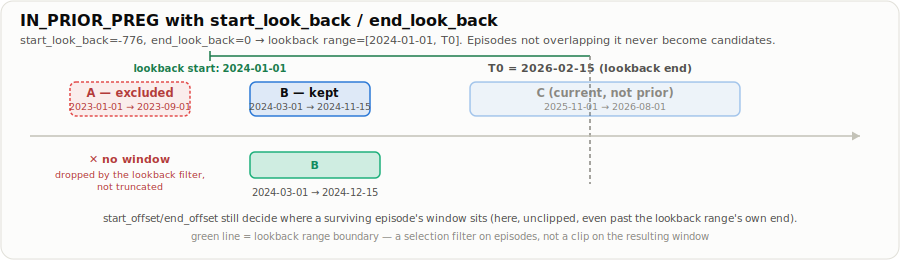

A single numerical example run through all four [episode-based](<../definitions/Episode-Based Window Engine.md>) constructors using the exported `define_window()` interface.

## Setup

One person with three episodes and an anchor (`T0`) inside the third:

| Episode     | event_start | event_end  |
| ----------- | ----------- | ---------- |
| A (prior)   | 2023-01-01  | 2023-09-01 |
| B (prior)   | 2024-03-01  | 2024-11-15 |
| C (current) | 2025-11-01  | 2026-08-01 |

`T0 = 2026-02-15` (falls inside episode C).

```r
library(anchoR)
library(data.table)

episodes <- data.table(
  event_start = as.Date(c("2023-01-01", "2024-03-01", "2025-11-01")),
  event_end   = as.Date(c("2023-09-01", "2024-11-15", "2026-08-01"))
)
anchor <- as.Date("2026-02-15")

make_windows <- function(
  constructor, start_offset, end_offset, end_cap_offset = NA_real_,
  start_look_back = NA_real_, end_look_back = NA_real_
) {
  population <- data.table(
    person_id = "1",
    anchor = anchor,
    episodes = list(episodes)
  )
  metadata <- data.table(
    variable_id = "demo",
    concept_id = "DEMO",
    constructor = constructor,
    selector = "ALL",
    start_offset = start_offset,
    end_offset = end_offset,
    anchor_start_col = "anchor",
    event_col = "episodes",
    end_cap_offset = end_cap_offset,
    start_look_back = start_look_back,
    end_look_back = end_look_back
  )
  define_window(population, metadata, anchor_col = "anchor")[
    window_valid == TRUE,
    .(window_start, window_end)
  ]
}
```

## [IN_PRIOR_PREG](../definitions/IN_PRIOR_PREG.md)

`start_offset = 0, end_offset = 30, end_cap_offset = 90`: both A and B ended before `T0`, so both produce a window, each capped to the episode's own first 90 days:

```r
make_windows("IN_PRIOR_PREG", 0L, 30L, end_cap_offset = 90)
```

| window_start | window_end | note                                 |
| ------------ | ---------- | ------------------------------------ |
| 2023-01-01   | 2023-04-01 | capped: uncapped would be 2023-10-01 |
| 2024-03-01   | 2024-05-30 | capped: uncapped would be 2024-12-15 |


### IN_PRIOR_PREG with `start_look_back`/`end_look_back`

`start_look_back`/`end_look_back` are a *separate* pair of columns from `start_offset`/`end_offset` (both `NA` unless set), and only `IN_PRIOR_PREG` reads them. They restrict *which episodes are eligible at all*: an episode not overlapping `[anchor + start_look_back, anchor + end_look_back]` is dropped before any window is built; a survivor's window is still computed from `start_offset`/`end_offset` exactly as above, unaffected by where the lookback range's edges fall.

With `start_look_back` set to `2024-01-01 - T0` (`-776` days) and `end_look_back = 0`, the lookback range is `[2024-01-01, 2026-02-15]`. Episode A (`2023-01-01`/`2023-09-01`) ended before that range starts, so it is dropped entirely; not truncated, just absent. Episode B overlaps the range, so it survives with the *same* window as the row above (`start_offset = 0, end_offset = 30`, no lookback):

```r
make_windows(
  "IN_PRIOR_PREG", 0L, 30L,
  start_look_back = -776, end_look_back = 0L
)
```

| window_start | window_end | note                                       |
| ------------ | ---------- | ------------------------------------------ |
| 2024-03-01   | 2024-12-15 | episode B only; episode A dropped entirely |



Compare to the unfiltered row above: episode A's window (`2023-01-01`/`2023-10-01`) is gone, not clipped to `2024-01-01`. If you want the OUTSIDE_ALL_PREG-style behavior of clipping a *search range* rather than filtering episodes, that's what `OUTSIDE_ALL_PREG`'s own `start_offset`/`end_offset` already does (see below); it is a different mechanism for a different constructor, not the same feature under a different name.

## [SINCE_START_CURRENT_PREG](../definitions/SINCE_START_CURRENT_PREG.md)

`start_offset = 0, end_offset = 0`: episode C contains `T0`; the window stops exactly at the anchor:

```r
make_windows("SINCE_START_CURRENT_PREG", 0L, 0L)
```

| window_start | window_end |
| ------------ | ---------- |
| 2025-11-01   | 2026-02-15 |


## [ANYTIME_CURRENT_PREG](../definitions/ANYTIME_CURRENT_PREG.md)

`start_offset = 0, end_offset = 14`: same episode C, but bounded by its own end plus a 14-day grace period:

```r
make_windows("ANYTIME_CURRENT_PREG", 0L, 14L)
```

| window_start | window_end |
| ------------ | ---------- |
| 2025-11-01   | 2026-08-15 |


## [OUTSIDE_ALL_PREG](../definitions/OUTSIDE_ALL_PREG.md)

`start_offset = -1172, end_offset = 0`: search range `[2022-12-01, 2026-02-15]`. Three gaps come back, fenced by A, B, and C; none touches `T0` since it sits inside the still-ongoing episode C:

> **`OUTSIDE_ALL_PREG` does not read `start_look_back`/`end_look_back`.** Its own `start_offset`/`end_offset` already are the anchor-relative range (there is no separate "shift the episode" role for them here, unlike `IN_PRIOR_PREG`/`SINCE_START_CURRENT_PREG`/`ANYTIME_CURRENT_PREG`), so setting `start_look_back`/`end_look_back` on an `OUTSIDE_ALL_PREG` row has no effect at all. If you set them expecting to control the search range, that's the bug to look for, use `start_offset`/`end_offset` instead.

```r
make_windows("OUTSIDE_ALL_PREG", -1172L, 0L)
```

| window_start | window_end | gap             |
| ------------ | ---------- | --------------- |
| 2022-12-01   | 2022-12-31 | before A        |
| 2023-09-02   | 2024-02-29 | between A and B |
| 2024-11-16   | 2025-10-31 | between B and C |


